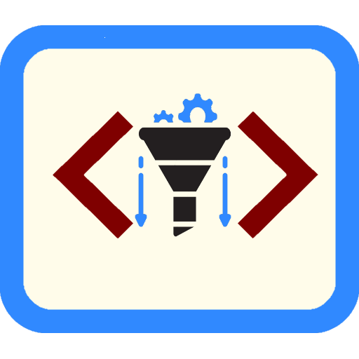

# Visual Studio Snippet Converter



This is a small hacky project to convert Visual Studio's Code Snippets (XML .snippet files) to:

* VS Code Code Snippets 
* Rider Live Templates (experimental)

This tool is available as a **.NET SDK Tool** that is easily installable as a command line utility using the .NET Core SDK 2.1 or later.

## Visual Studio Code Conversion
This tool can take individual Visual Studio snippets, a folder full of `.snippet` files, or an entire folder hierarchy and create or update a single `.code-snippet` file with each of the the snippets added from Visual Studio into a VS Code snippet file.

> Note that Rider support is limited to C#,VB.NET and HTML snippets only. Other language templates are stored in a completely different format and are currently not supported. If there's interest in that we might consider adding it later - for now this isn't supported.

### Using the .NET SDK Tool Console Application
The easiest way to use this tool is to install the dotnet tool from NuGet. To install:

```ps
install-package dotnet-snippetconverter
```

**Requires:**  
[.NET Core 2.1 SDK](https://dotnet.microsoft.com/downloadhttps://dotnet.microsoft.com/download) or later

Once installed you should able to run:

```ps
snippetconverter
```

from the Terminal and get the usage Help screen.

Alternately, if you just use the source code to compile the project, you can use

```
dotnet run
```

from the project folder.

Or in the `publish` folder one of these:

```
snippetconverter
```

### Command Line Options

```text
Visual Studio Snippet Converter
-------------------------------
© Rick Strahl, West Wind Technologies

Syntax:
-------
SnippetConverter <sourceFileOrDirectory> -o <outputFile> 
                 --mode --prefix --recurse --display

Commands:
---------
HELP || /?          This help display           

Options:
--------
sourceFileOrDirectory  Either an individual snippet file, or a source folder
                       Optional special start syntax using `~` to point at User Code Snippets folder:
                       ~      -  Visual Studio User Code Snippets folder (latest version installed)
                       ~2017  -  Visual Studio User Code Snippets folder (specific VS version 2019-2012)                       

-o <outputFile>        Output file where VS Code snippets are generated into (ignored by Rider)                        
                       %APPDATA%\Code\User\snippets\ww-my-codesnippets.code-snippets
                       ~\ww-my-codesnippets.code-snippets
                       ~            -   defaults to visualstudio-exported.code-snippets
                       

-m,--mode              vs-vscode  (default)
                       vs-rider   experimental - (C#,VB.NET,html only)
-d                     display the target file in Explorer
-r                     if specifying a source folder recurses into child folders
-p,--prefix            snippet prefix generate for all snippets exported
                       Example: `ww-` on a snippet called `ifempty` produces `ww-ifempty`

Examples:
---------
# vs-vscode: Individual VS Snippet (output to %APPDATA%\Code\User\snippets)
SnippetConverter "~2017\Visual C#\My Code Snippets\proIPC.snippet" 
                 -o ""~\ww-csharp.code-snippets"" -d

# vs-vscode: All the user VS Snippets and in recursive child folers
SnippetConverter ~2017\ -o ~\ww-csharp.code-snippets" -r -d

# vs-vscode: All the user VS Snippets and in recursive child folers
SnippetConverter ~2017\ -o "~\Code\User\snippets\ww-csharp.code-snippets" -r -d

# vs-vscode: All defaults: Latest version of VS, all snippets to  %APPDATA%\Code\User\snippets\visualstudio-export.code-snippets
SnippetConverter -r -d

# vs-rider: Individual VS Snippet
SnippetConverter "~2017\Visual C#\My Code Snippets\proIPC.snippet" -m vs-rider 

# vs-rider: All VS Snippets in a folder
SnippetConverter "~2017\Visual C#\My Code Snippets" -m vs-rider
```


### Use at your own Risk
This is a very rough project I created to just get the job of converting my CSharp, HTML and JavaScript templates between environments. I make no guarantees that it'll move all types of snippets nor that it will capture all features of the snippets. However, it works very well for my use case which has been able to easily migrate all of my Visual Studio snippets to both VS Code and Rider.
 
Your mileage may vary!

## License
The SnippetConverter library is licensed  under the [MIT License](https://opensource.org/licenses/MIT) and there's no charge to use, integrate or modify the code for this project. You are free to use it in personal, commercial, government and any other type of application.

All source code is copyright **West Wind Technologies**, regardless of changes made to them. Any source code modifications must leave the original copyright code headers intact.

<!-- 
> It's free as in free beer, but if this saved you some time and you're overflowing with gratitude you can buy me a beer:
>
> [**Donate with PayPal**](https://www.paypal.com/cgi-bin/webscr?cmd=_s-xclick&hosted_button_id=DJJHMXWYPT3E2)
-->

## Warranty Disclaimer: No Warranty!
IN NO EVENT SHALL THE AUTHOR, OR ANY OTHER PARTY WHO MAY MODIFY AND/OR REDISTRIBUTE THIS PROGRAM AND DOCUMENTATION, BE LIABLE FOR ANY COMMERCIAL, SPECIAL, INCIDENTAL, OR CONSEQUENTIAL DAMAGES ARISING OUT OF THE USE OR INABILITY TO USE THE PROGRAM INCLUDING, BUT NOT LIMITED TO, LOSS OF DATA OR DATA BEING RENDERED INACCURATE OR LOSSES SUSTAINED BY YOU OR LOSSES SUSTAINED BY THIRD PARTIES OR A FAILURE OF THE PROGRAM TO OPERATE WITH ANY OTHER PROGRAMS, EVEN IF YOU OR OTHER PARTIES HAVE BEEN ADVISED OF THE POSSIBILITY OF SUCH DAMAGES.